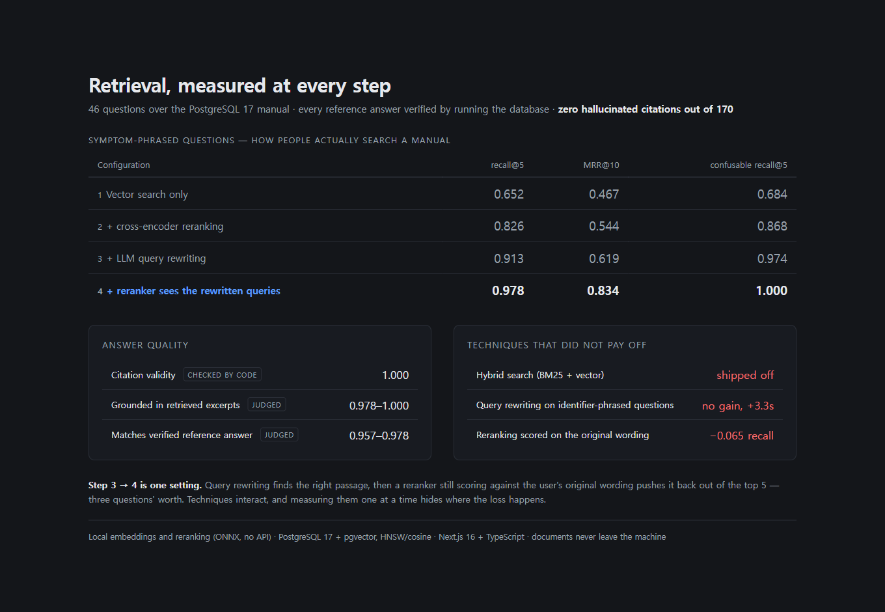
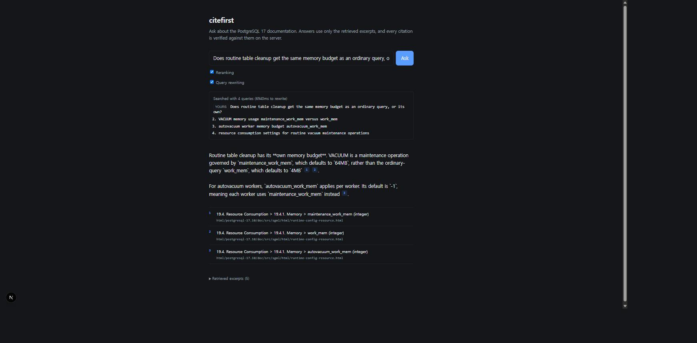
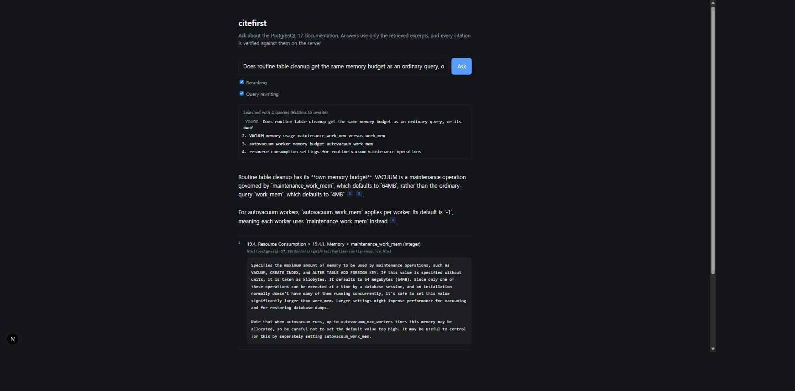
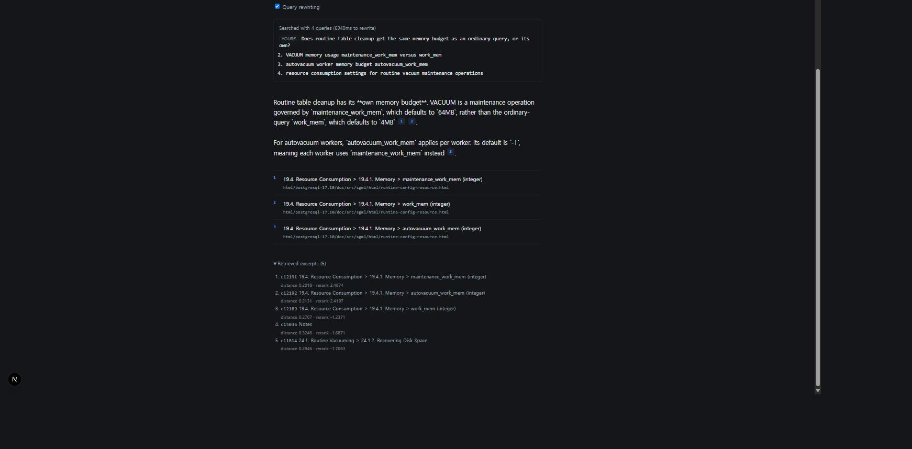

# citefirst

A RAG system that answers from your documents — with citations verified against the retrieved
chunks before they ever reach the screen, and retrieval quality measured rather than asserted.

Built over the **PostgreSQL 17 documentation**: ~3,000 pages of a real manual, full of passages
that look nearly identical (`pg_dump` vs `pg_dumpall`, `VACUUM` vs `VACUUM FULL`, five different
`*_work_mem` settings). Exactly the corpus where naive vector search quietly returns the wrong
paragraph and nobody notices.

**Embedding and reranking run locally.** Ingestion makes no outbound calls at all, and retrieval
makes none either unless query rewriting is enabled — in which case the question, never the
corpus, is what leaves the machine.

---

## Results

46 questions, in the shipped configuration (local embeddings, query rewriting, cross-encoder
reranking). Every number here was produced by `npm run eval`; the raw runs are committed under
[`eval/results/`](eval/results).

| | Reranking off | Reranking on |
|---|---|---|
| recall@5 | 0.957 | **0.978** |
| MRR@10 | 0.778 | **0.853** |
| recall@5 (confusable questions only) | 0.947 | **1.000** |
| citation validity | 1.000 | **1.000** |
| grounded | 1.000 | **1.000** |
| answer correctness | **1.000** | 0.978 |

The same 46 questions with no rewriting and no reranking — plain vector search — score
**0.652**. How each technique got from there to here is broken down below.

**Zero hallucinated citations, out of 168 citations across the two runs.** Every `[chunk_id]` the
model emitted matched a chunk that had actually been retrieved for that question.

**`grounded` is 1.000 in both runs**, including the one question where retrieval failed. Asked
what format `pg_dump` writes by default, the system said the excerpts did not state it rather
than answering from what it already knows about PostgreSQL — and it knows. Retrieval failure
produced a refusal, not a fabrication. That property is what the whole design is for, and it is
measurable only because `grounded` and `correct` are graded as separate questions.

Note the correctness column runs the other way: reranking gained recall and cost one answer.
Both columns are shown rather than the better one.

Full numbers, per-question failure analysis, and the exact model used:
[`docs/portfolio.md`](docs/portfolio.md).

**Why each of these choices was made — including the two that did not work out —**
[`docs/decisions-en.md`](docs/decisions-en.md). The full decision log
([`docs/decisions.md`](docs/decisions.md)) is in Korean; `decisions-en.md` translates the
three entries where the result contradicted the expectation, two of them failures.

### How each technique earned its place

Every row below is a measured run over the same 46 symptom-phrased questions. Each adds one
thing to the row above it:

| Configuration | recall@5 | MRR@10 | confusable recall@5 |
|---|---|---|---|
| Vector search only | 0.652 | 0.467 | 0.684 |
| \+ cross-encoder reranking | 0.783 | 0.527 | 0.842 |
| \+ query rewriting | 0.848 | 0.606 | 0.921 |
| \+ giving the reranker the rewritten queries too | **0.978** | **0.853** | **1.000** |

The last row is the interesting one, and it is worth being precise about what changed.

### Reranking can undo the work retrieval just did

Query rewriting sends the user's question to an LLM and gets back the words the manual would
use, then searches with all of them:

```
"Does routine table cleanup get the same memory budget as an ordinary query?"
  → maintenance_work_mem memory for VACUUM and maintenance operations default setting
  → work_mem versus maintenance_work_mem resource consumption
  → autovacuum_work_mem memory budget for autovacuum workers default setting
```

That works: with rewriting on and **no reranking at all**, recall@5 is 0.957.

Turn reranking back on with its default configuration and it drops to **0.848**. Six questions
whose answers were sitting in the candidate list got pushed out of the top 5.

The cause is that the cross-encoder was still scoring against the *original* wording.
`bge-reranker-base` is a small model with no domain knowledge — it cannot connect "routine table
cleanup" to `maintenance_work_mem` any more than the embedding model could. So it looked at the
chunk rewriting had just found and judged it unlike the question.

Give the reranker the expanded query and it goes to **0.978**. Reranking still earns its keep —
but only once it can cross the same bridge:

| Reranking (rewriting on, identical candidates) | recall@5 | MRR@10 |
|---|---|---|
| Off | 0.957 | 0.778 |
| On, scored against the original question | 0.848 | 0.606 |
| On, scored against the expanded query | **0.978** | **0.853** |

Those three rows searched the *same* candidates — rewrites are frozen in a committed cache, so
the run is reproducible and only the reranker's input differs. Measuring techniques one at a
time would have hidden this entirely: rewriting on/off looks like a win either way.

### It depends on how your users phrase questions

The same 46 facts were asked twice — once as symptoms, once with the exact identifier:

| Question style | Reranking (recall@5) | Query rewriting (recall@5) |
|---|---|---|
| Describes the symptom | 0.652 → **0.783** ✅ | 0.783 → **0.978** ✅ |
| Uses the exact parameter name | 0.978 → 0.957 ❌ | 0.957 → 0.957 (no change) |

Anyone who already knows the identifier `work_mem` does not need search. People reading a manual
describe symptoms — and that is exactly where both techniques pay off. On identifier-phrased
questions, rewriting adds 3.3 seconds and ~630 tokens per query for nothing.

A worked example of what the reranker does, from a live query:

| Chunk | Vector distance | Reranker score |
|---|---|---|
| `work_mem` ← correct | 0.3493 (2nd) | **1.83 (1st)** |
| `temp_file_limit` | **0.3261 (1st)** | −0.98 |

Vector search ranked `temp_file_limit` first — the question contained "disk", "temporary" and
"sort", and so does that document. But the user wanted a *memory* cap. The cross-encoder reads
question and passage together, so it separates them, and by a wide margin.

### A finding that did not survive a larger sample

At 26 questions this README reported that reranking *hurt* MRR on identifier-phrased questions
(0.839 → 0.804). At 46 it goes the other way (0.823 → **0.857**), while recall@5 drops slightly
instead (0.978 → 0.957).

The original claim was a 26-question artefact. It is called out rather than quietly edited
because it is the honest illustration of a limit stated below: at this sample size the third
decimal is noise, and a difference of one or two questions can reverse a conclusion.

### And a technique that stayed switched off

Hybrid retrieval — Postgres full-text search fused with vector search via RRF — was built on the
assumption that the remaining failures were vocabulary gaps a keyword index could close. It was
measured, and the assumption was wrong: at the time it *lowered* confusable recall (0.895 →
0.842). If the question never says `VACUUM`, keyword search cannot find that document either —
BM25 leans *harder* on lexical overlap, not less. It promoted unrelated documents and pushed
good vector candidates out of the fused list.

Query rewriting removed the cause. The rewritten queries do contain `VACUUM`, so keyword search
finds the right document and hybrid is no longer harmful:

| Symptom-phrased, rewriting on | Hybrid off | Hybrid on |
|---|---|---|
| recall@5 | 0.978 | 0.978 |
| MRR@10 | 0.853 | 0.865 |

It still ships disabled. recall@5 is identical, and +0.012 MRR is one question moving one place
at this sample size — not enough to justify an extra full-text query per rewritten query.
**The cause being gone is not by itself a reason to turn something on.**

The code and both switches stay in the shipped build. Which techniques apply to a given corpus
depends on how its users phrase questions, and there is no way to know without measuring — so
the switches, and the harness that flips them, are part of the deliverable.

## What it looks like



Generated from `public/results-card.html` so it stays in step with the committed runs rather
than being redrawn by hand.



The panel above the answer shows what was actually searched. The user asked about "routine table
cleanup"; the rewriter turned that into three queries naming `maintenance_work_mem`,
`autovacuum_work_mem` and `work_mem`, and all four queries were searched. Showing this is the
same principle as verifying citations — a retrieval step the user cannot inspect is a retrieval
step they have to take on faith.

Citations render as footnotes only after the server has matched each `[chunk_id]` against the
chunks actually retrieved for that question. During streaming the raw text is shown; the
verified version replaces it on completion, because mid-stream you cannot yet know whether
`[c71` will resolve to anything.



Clicking a citation opens the exact stored passage — verbatim, with nothing the pipeline added.
The claim "the default is four megabytes (4MB)" can be checked against the source without
leaving the page. That is the difference between a citation and a footnote-shaped decoration.



Both stages are exposed: cosine distance from vector search and the cross-encoder score that
reordered them. Nothing is hidden behind a single relevance number — including cases where the
reranker's top choice is not the chunk the answer ended up citing.

---

## Why the PostgreSQL manual

Because **the answer labels can be verified by execution.** The weakest point of any RAG
evaluation is whether the ground truth is actually true. Pick a corpus that needs domain
expertise and your labels become guesses — and then every retrieval metric derived from them is
meaningless, while still looking like data.

This corpus is the manual of the database the system itself runs on. All 26 answers were
confirmed against a live PostgreSQL 17.10 instance, never by reading the corpus (which would be
circular). Where a simple query was not enough, an experiment was designed:

- **`effective_cache_size` does not allocate memory** — set to 4GB, yet
  `SELECT sum(size) FROM pg_shmem_allocations` returns 142.9 MB.
- **A failed `CREATE INDEX CONCURRENTLY` leaves an invalid index behind** — forced a failure with
  a unique index over duplicate values, then found it in `pg_index` with `indisvalid = false`.
- **`VACUUM FULL` takes `ACCESS EXCLUSIVE`** — observed in `pg_locks` from a second session
  during a run over 3M rows. On a small table it finishes before you can look.
- **`lock_timeout` only fires while waiting for a lock** — a slow statement with no contention is
  unaffected; it fires only when another session holds `ACCESS EXCLUSIVE`.

Each question records the command used in a `verified_by` field. **The harness refuses to run if
any question is still unverified** — that closes the path where "I'll check it later" silently
becomes a published number.

---

## Implementation

### Parsing and chunking

Fixed-size token slicing is not used. Chunks break on paragraph and heading boundaries only,
because a chunk with a sentence cut in half is useless for both retrieval and citation.

The DocBook HTML that PostgreSQL ships needs several specific things, every one of which was
found by inspecting real output rather than by guessing — and, notably, none of which the
metrics would have surfaced:

**Navigation is stripped.** Every page repeats a `Prev / Up / Next` block. Left in, it lands in
every chunk and the embeddings start encoding navigation similarity instead of content.

**`<dt>` is promoted to a heading.** Configuration parameters are published as
`<dl><dt>name</dt><dd>description</dd>…</dl>`. Swallowing the `<dl>` whole merges `work_mem`,
`maintenance_work_mem` and `temp_buffers` into one blob that then gets split on a token budget —
producing chunks like *"The default value is 2MB"* with no way to tell which parameter it
describes. Treating `<dt>` as a boundary is the single most important structural decision for
this corpus.

**Overlap stops at heading boundaries.** Carrying the tail of the previous chunk forward is
standard practice, but across a parameter boundary it drags `hash_mem_multiplier` text into the
chunk headed `maintenance_work_mem` — manufacturing exactly the confusion the corpus was chosen
to test. Overlap now applies only within the same heading.

**`<pre>` is parsed, not taken as raw text.** Telling the parser to treat `<pre>` contents as
raw text preserves the whitespace in SQL examples — and preserves the markup with it. 384 of
5,028 chunks contained literal `<code class="prompt">` in their body, which meant expanding a
citation showed a user HTML tags. Parsing `<pre>` normally keeps the whitespace and drops the
tags.

**Overlap is bounded.** Taking whole trailing sentences until the budget runs out returns the
*entire* chunk when the block has no sentence boundary at all — so the next chunk contained the
previous one verbatim, and one answer's search results held the same text twice.

Source line breaks are normalised (`ACCESS\n   EXCLUSIVE` → `ACCESS EXCLUSIVE`), since DocBook
wraps at 80 columns and that wrapping is not meaningful text.

The last two were found while writing new evaluation questions, at a point when every metric
read 1.000. A harness measures the paths its labels touch; the other 289 documents in this
corpus it says nothing about.

### Embedding

Chunks are embedded with `bge-base-en-v1.5` (768-dim, CLS pooling, L2-normalised) running in
ONNX on the local CPU — no API, no data leaving the machine. The full corpus — 309 documents,
**5,012 chunks** — ingests in **550 seconds**, about 110 ms per chunk.

Three details matter more than the model choice:

**The embedded text is not the stored text.** Each chunk carries `content` (verbatim, what a
citation displays) and `embedText` (the heading path prepended). A paragraph reading *"It
defaults to 64MB"* is meaningless as a standalone vector — prepending
`19.4. Resource Consumption > Memory > maintenance_work_mem` puts the subject into the vector.
The two are kept separate so that expanding a citation never shows text that was not in the
source.

The document title is included in that prefix. SQL command pages have headings of only
"Description" / "Parameters" / "Notes", so without it **the chunk explaining `VACUUM` contained
no vector trace of the word "VACUUM"** — measured, and worth +0.039 recall@5 once fixed.

**Queries are embedded differently from documents.** BGE models need an instruction prefix on
the query side only. Dropping it measurably degrades short-question → long-passage retrieval.

**Nothing may exceed the model's 512-token input.** Anything past that is truncated at embedding
time — silently, with no error — so the tail of an oversized chunk is unreachable by vector
search while the chunk still looks fine in the database. Blocks with no sentence boundary to
split on (keyword tables, column lists, example pages) are therefore split at word boundaries
rather than emitted whole. Before that fix, 137 chunks were over the limit and the largest was
8,060 tokens. A rough chunk boundary beats an unsearchable chunk.

### Retrieval

pgvector with an HNSW index over cosine distance. The question is expanded into 2–3 additional
queries by the rewriter, each is searched, and the rankings are fused with Reciprocal Rank
Fusion (k=60) — ranks, not scores, because cosine distance and `ts_rank_cd` are not on a
comparable scale and normalising them turns into per-query tuning that never ends.

The top-20 fused candidates go to a `bge-reranker-base` cross-encoder, which scores question and
passage jointly and returns the top-N. Both reranking and rewriting can be switched off at
runtime, and the reranker's query can be switched between the original and the expanded form.
Those switches produce the before/after tables above and are deliberately kept in the shipped
code rather than removed after measuring.

Every retrieval returns a trace: the queries actually searched, the vector-search ordering, the
final ordering, and per-stage timings. Without it you cannot tell whether a stage changed
anything or merely cost you time — and with rewriting on, the user cannot otherwise see what was
searched on their behalf.

### Citation verification

The product claim is *"citations you can check"*, so a hallucinated citation reaching the UI
would refute the entire premise. Chunks are injected into the prompt with their real database
IDs; the model cites `[c1234]`; the server then matches every emitted ID against **the chunks
actually retrieved for that request** — not the whole database. An ID the model was never shown
cannot be verified, because guessing it correctly is not evidence of having read anything.

Unmatched citations are removed from the rendered text and counted. In the measured run that
count was zero, which is what makes `citation validity = 1.000` a claim rather than a hope.

Streaming complicates this: mid-stream you cannot know whether `[c12` will become a valid ID.
So the UI renders the raw stream while it arrives and swaps in the verified text on completion.

### Evaluation harness

- **`recall@5`** — was a gold chunk in the top 5
- **`MRR@10`** — reciprocal rank of the first gold chunk
- **`citation validity`** — share of emitted citations that resolved to real retrieved chunks
- **`grounded`** — judged: is the answer supported *by the excerpts alone*
- **`correct`** — judged: does it match the execution-verified reference answer

Four design choices keep the numbers honest:

**Gold chunks are specified by content, not by ID.** `chunks.id` is a serial that changes on
every re-ingest; a label pinned to an ID silently goes stale the moment chunking is retuned —
and still produces plausible numbers. Labels instead name a source document and strings the
chunk must contain, resolved against the database at run time. If a label matches nothing the
harness **fails loudly**; if it matches too many chunks it fails as loose. The re-ingest after
the chunking fixes changed every chunk ID in the database and not one label needed touching.

**Reference answers come from running the software, never from the model.** Each question
records the command that produced its answer in a `verified_by` field, and the harness refuses
to run if any question is not marked verified. Where a value could not be read off directly the
answer came from a designed experiment — `VACUUM FULL`'s lock class was read from `pg_locks`
during a run over a 3-million-row table, not from the manual.

That has a trap of its own. `SHOW work_mem` returns the *running* value, which on a
distribution package includes `postgresql.conf` overrides — on this box `SHOW ssl` says `on`
while the documented default is `off`. Defaults are therefore taken from `pg_settings.boot_val`.
Using `SHOW` would have graded answers against this machine instead of against the manual.

**The judge grades evidence, not truth.** This is the one real trap of this corpus: the model
already knows PostgreSQL well and will happily confirm a correct answer it never read. So
`grounded` and `correct` are asked as separate questions, and the judge is instructed that a
true statement absent from the excerpts is *not* grounded. Without that separation this harness
would be measuring how well the model knows Postgres, not how well retrieval works.

**Non-deterministic steps are frozen.** Query rewrites are cached to a committed file, along
with the latency and token count of the call that produced each one. Otherwise two runs of an
identical configuration disagree — they did, by 0.038 recall@5 — and every A/B carries that
noise. The recorded cost means the latency figures stay measurements rather than estimates.

A companion checker (`npm run check-gold`) validates labels against the corpus **without a
database**, by chunking the files directly. It caught 4 broken labels before an ingest rather
than after, and it rejected one of the new questions outright: `max_wal_size` and `min_wal_size`
never share a chunk, so a question asking for both could not have a valid single-chunk label.
The question was narrowed rather than the label loosened.

---

## Stack

| Layer | Choice |
|---|---|
| App | Next.js 16 (App Router) + TypeScript |
| Vector store | PostgreSQL 17 + pgvector (HNSW, cosine) |
| Embeddings | `bge-base-en-v1.5`, local ONNX inference |
| Reranking | `bge-reranker-base` cross-encoder, local |
| Query rewriting | same endpoint as answers; rewrites cached to a committed file |
| Answers | `gpt-5.6-sol` over the Anthropic Messages protocol |
| Local infra | Docker Compose, or Postgres in WSL2 |

The answer layer speaks the **Anthropic Messages protocol** but is not tied to one provider.
Pointing `ANTHROPIC_BASE_URL` at any compatible endpoint swaps the backing model without a line
of code changing — the measurements above were taken against `gpt-5.6-sol` through a local
proxy, and the same build runs against Anthropic directly by clearing that variable.

That is a deliberate property, not a workaround. Model choice is the part of a RAG system most
likely to change after delivery: a client switches vendors, a subscription ends, a compliance
review rules a provider out. Everything that determines retrieval quality — parsing, chunking,
embedding, reranking, citation verification — sits below that line and is unaffected.

**Documents never leave the machine.** Ingestion, embedding and reranking are fully local. Two
steps make outbound calls and neither sends the corpus: the answer step sends the retrieved
excerpts, and the rewriter sends the user's question. Set `REWRITE_ENABLED=false` and the
question stays local too, at the retrieval cost measured above. For contracts or internal
policy that distinction is usually the whole conversation. Rationale:
[`docs/decisions.md`](docs/decisions.md) D11.

## Known limits

Stated plainly, because a portfolio piece that only lists wins is not credible.

- **Part of the rewriting gain is the model's prior knowledge, not better retrieval.** The
  rewriting model already knows PostgreSQL; turning "sorts spilling to disk" into `work_mem` is
  recall from training, not search. The same technique over documents the model has never seen —
  your internal policies, your product's own vocabulary — will gain less unless the rewriting
  prompt is given a glossary. This is the single number here least likely to transfer.
- **Query rewriting is not deterministic.** Two runs of an identical configuration differed by
  0.038 recall@5 before rewrites were frozen. They are now cached to a committed file so the
  published numbers reproduce; regenerate that file and the table must be regenerated with it.
- **46 questions is still a small sample.** Treat the third decimal as noise — one finding
  already reversed between 26 and 46 questions (see above).
- **The one remaining retrieval failure is a chunking trade-off, not a bug.** Promoting each
  `<dt>` to a heading is what stops `work_mem` and `maintenance_work_mem` bleeding into one
  chunk, and it is why the confusable questions score 1.000. But when a definition is a single
  line — *"Output a plain-text SQL script file (the default)."* — it produces a chunk too small
  to retrieve, and its parent, which introduces the list without containing the answer, wins
  instead. Fixing it means merging short definitions back, which risks the separation that
  every confusable question depends on. That needs its own measurement cycle.
- **recall@5 understates quality.** Some questions score 0 while the answer is still correct,
  because more than one chunk contains the fact and the label credits only one.
- **Retrieval latency is now dominated by the rewriting call** — ~4.1s mean, 12.6s worst case,
  against ~0.2s for embedding and vector search. Interactive use needs streaming and a cache.
- **One corpus.** Nothing here demonstrates generalisation to other document types.
- **The evaluation cannot see corpus defects off the labelled path.** Three real parsing and
  chunking defects — including 137 chunks silently truncated at the embedding model's 512-token
  limit, one of them 8,060 tokens — were found by reading chunk output while writing new labels,
  not by any metric. The metrics were 1.000 at the time. 46 questions touch roughly 20 of 309
  documents; what happens in the other 289 is unmeasured. See
  [`docs/decisions.md`](docs/decisions.md) D14.
- **PDF and DOCX parsers are implemented but unverified** against real files — recorded as such
  in [`docs/parser-coverage.md`](docs/parser-coverage.md) rather than claimed as working.

## Getting started

You need Postgres 17 with pgvector. Either path works:

```bash
docker compose up -d      # option A — Docker
```

```bash
# option B — Postgres inside WSL2 (no Docker Desktop needed).
# WSL2 forwards localhost, so this is reachable from Windows at localhost:5432.
wsl -u root -e bash -lc '
  install -d /usr/share/postgresql-common/pgdg
  curl -sS -o /usr/share/postgresql-common/pgdg/apt.postgresql.org.asc --fail \
    https://www.postgresql.org/media/keys/ACCC4CF8.asc
  echo "deb [signed-by=/usr/share/postgresql-common/pgdg/apt.postgresql.org.asc] \
    https://apt.postgresql.org/pub/repos/apt $(lsb_release -cs)-pgdg main" \
    > /etc/apt/sources.list.d/pgdg.list
  apt-get update -qq && apt-get install -y postgresql-17 postgresql-17-pgvector
  service postgresql start
  su - postgres -c "psql -c \"CREATE USER citefirst WITH PASSWORD '"'"'citefirst'"'"' SUPERUSER;\""
  su - postgres -c "createdb -O citefirst citefirst"
'
```

Ubuntu's own repository carries only Postgres 16. PGDG is added because the evaluation labels
were verified against **17** specifically — the version is part of the ground truth.

Then:

```bash
cp .env.example .env      # embeddings need no key; the answer layer needs a key or proxy URL
npm install
npm run smoke             # parser / chunker / citation checks — no DB, no keys, no network
npm run db:migrate
npm run corpus:fetch      # PostgreSQL 17 docs into corpus/ (~3.6 MB)
npm run ingest            # ~9 minutes on CPU (309 docs, 5,012 chunks)
npm run ask -- "My sorts keep spilling to disk. Which setting caps that?"
npm run eval
npm run dev
```

| Command | What it does |
|---|---|
| `npm run smoke` | Parser, chunker, citation verifier. No database, keys, or network. |
| `npm run embed:check` | Downloads the local models and proves reranking separates confusable passages. |
| `npm run ingest:estimate` | Chunk count and measured throughput before committing to a full ingest. |
| `npm run corpus:fetch` | Downloads the PostgreSQL 17 docs. `--with-pdf` also fetches the PDF. |
| `npm run ingest` | Parse → chunk → embed → store. `--all`, `--include`, `--force`, `--limit`. |
| `npm run chunks <file>` | Inspect how one document was chunked. `--grep`, `--full`. |
| `npm run check-gold` | Validate evaluation labels against the corpus — works without a database. |
| `npm run ask -- "…"` | One question from the CLI. `--no-rerank`, `--no-rewrite`, `--retrieve-only`. |
| `npm run eval` | The harness, reranking off and on. `--retrieval-only`, `--only`, `--questions`. |

Retrieval behaviour is set by environment, and each switch was chosen from a measurement rather
than a default: `RERANK_ENABLED`, `REWRITE_ENABLED`, `RERANK_QUERY` (`original` \| `expanded`),
`HYBRID_ENABLED`. `.env.example` records what each one measured. Results are written per
configuration, so turning one on does not overwrite the comparison you turned it on against.
| `npm run parser:check` | Exercises each format parser against real files and records coverage. |

## License

MIT
